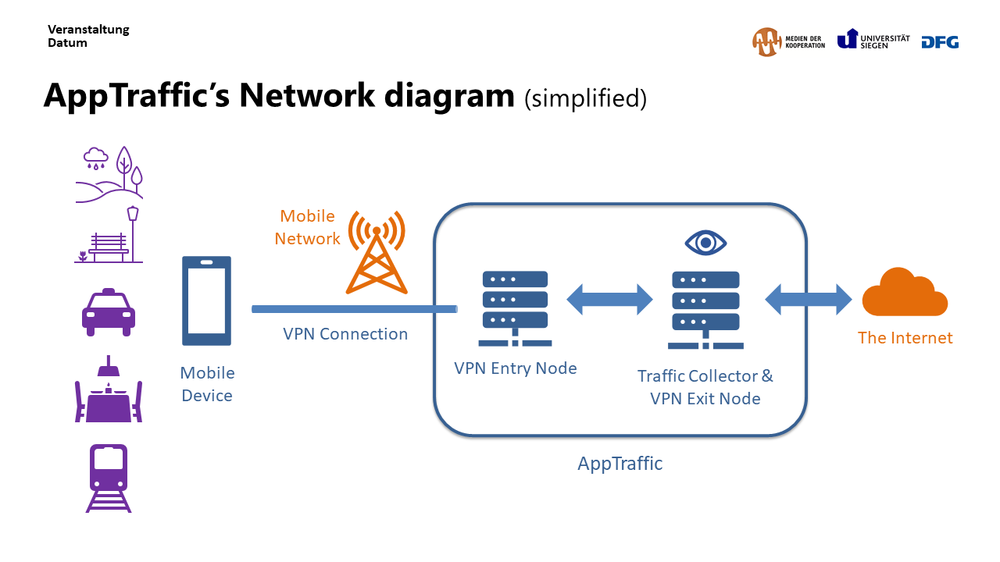
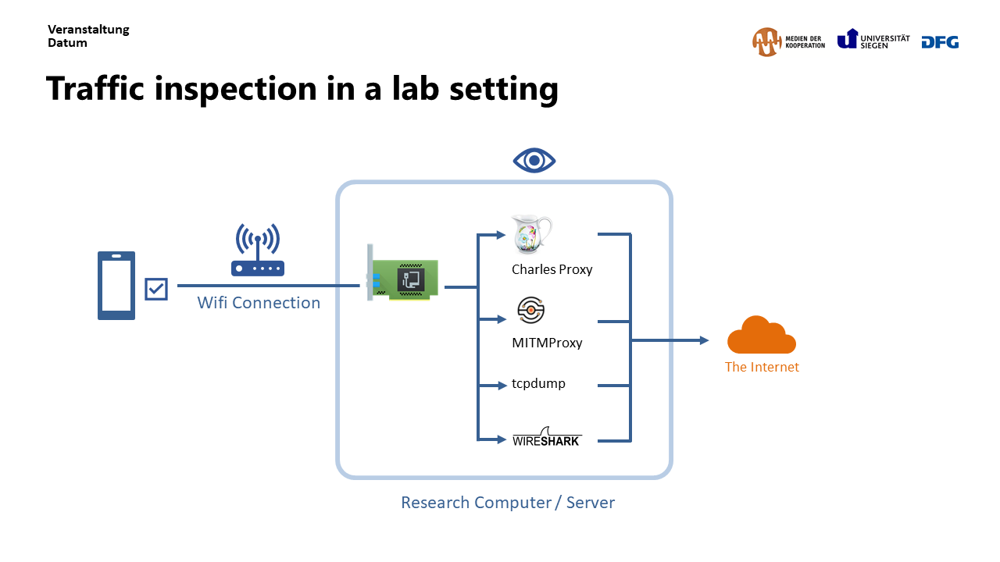
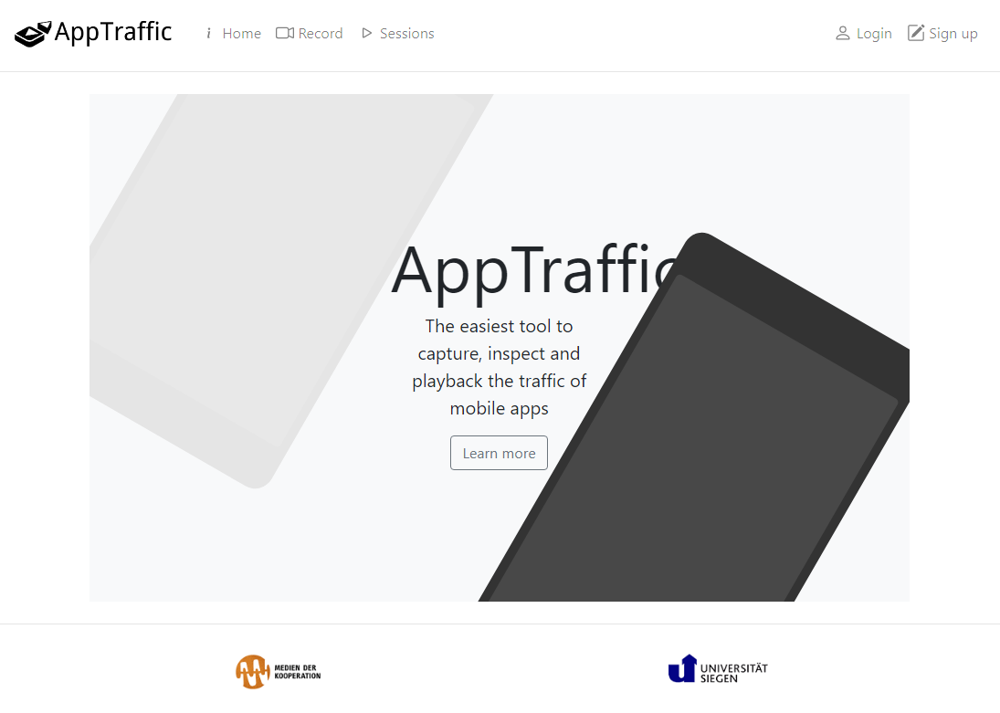
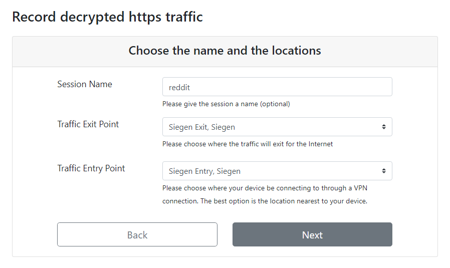
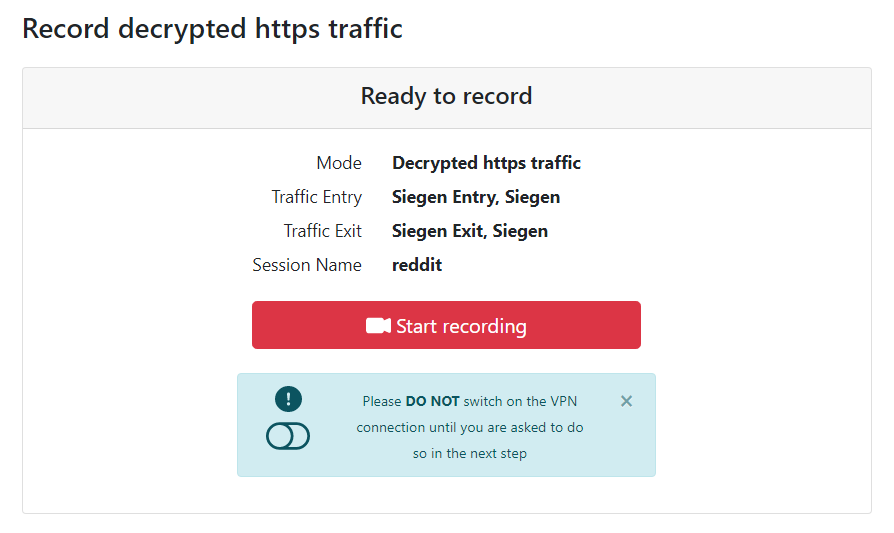
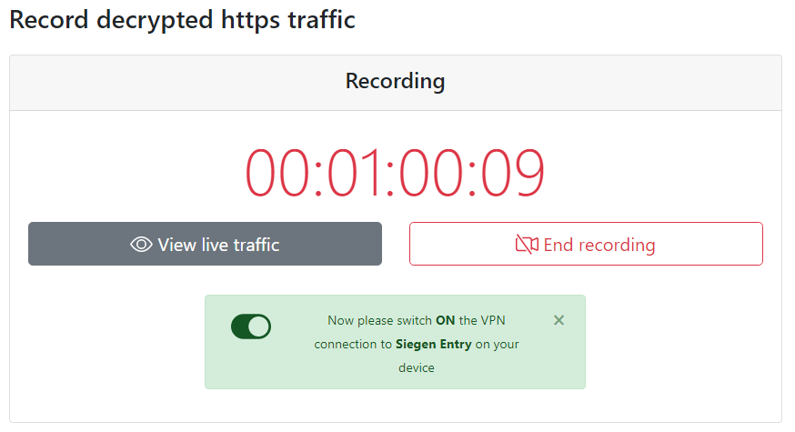
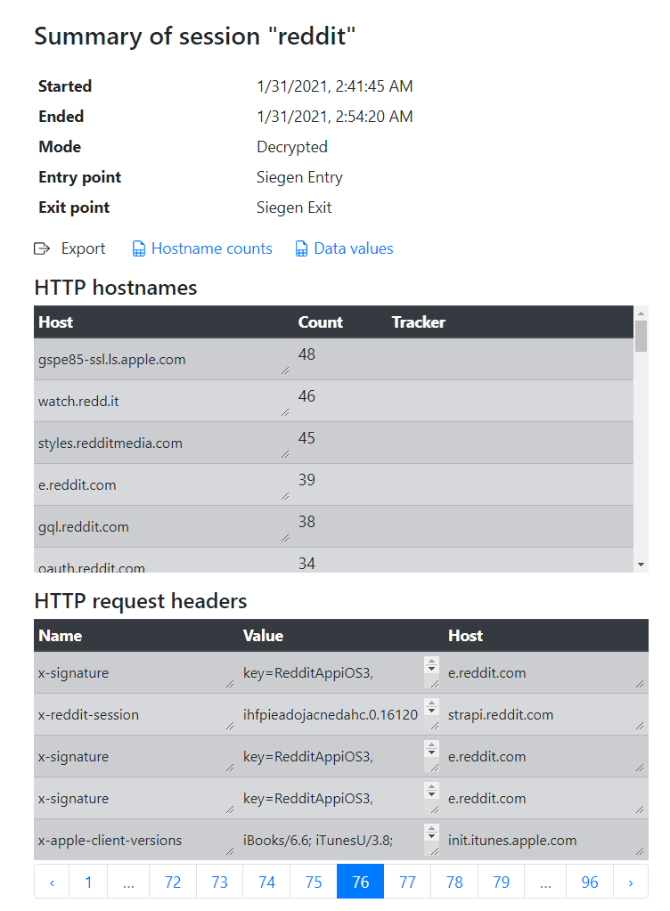

# Opening up the blackbox of the traffic of mobile apps

## Contents
* [Introduction to AppTraffic](#introduction-to-apptraffic)
* [Using AppTraffic](#using-appTraffic)
  * [Sign up](#sign-up)
  * [Record a session](#record-a-session)
  * [Open a session](#open-a-session)

## Introduction to AppTraffic

AppTraffic is a scalable tool for studying the network traffic of mobile applications.  AppTraffic enables the capture of network traffic while the research device is being carried around and used in different settings.

Past studies on studying mobile devices' network traffic usually required a “lab setting” in which a research device is connected to a dedicated WiFi hotspot.   The traffic is routed from the network device to the traffic inspector or recorder.  

A major disadvantage of the lab setting is a lack of scalability in terms of user capacity and locality.  Lab settings are good for a couple of research devices but may be hard to simultaneously accommodate multiple devices.  When multiple devices are being studied at the same time, sophisticated routing or filtering rules must be applied to prevent traffic inspectors and recorders from mixing up the traffic originating from different devices.  Also, research devices have to be within reach of a dedicated WiFi network to work.  

AppTraffic creates an exclusive VPN connection for each research device to allow for clean data collection and disentangle the devices from a fixed location.  AppTraffic can capture the traffic of multiple devices simultaneously anywhere as long as the devices are connected to the Internet. 

AppTraffic has three data captures modes.

* Decrypted mode
  * Tries to break the encryption between the apps and the servers
  * Might not work with some apps and devices
* Raw mode
  * Does not attempt to break the encryption and just records everything
  * Tells you the time, size of the destinations of the data packets
* Metadata mode
  * Only records the time, size of the destinations of the data packets
  * Almost the same as “raw” but without the payload

The Decrypted mode of AppTraffic uses a technique called “man-in-the-middle” to intercept the encrypted data.  Due to security restrictions, some devices and some apps do not work with Decrypted mode.   This technique works with the latest versions of iOS.  However, Android versions above 7 do not work with Decrypted mode.  Some popular apps and finance apps implement a mechanism called “certificate-pinning” which is designed to prevent “man-in-the-middle” attacks.   Unfortunately, AppTraffic does not work with apps which implement “certificate-pinning”.  

## Using AppTraffic

AppTraffic is available at [https://apptraffic.phil.uni-siegen.de/](https://apptraffic.phil.uni-siegen.de/)

### Sign up

Before you can start using AppTraffic, please click `Sign up` at the top-right corner to create an account.

After signing up, please log in using the login details you just provided.  For the time being, the approval procedure is suspended.   All new accounts are active by default.  So, you **do not need to contact me to seek approval**.

### Record a session

Click `Record` at the top.  Select the data capture mode.  If you use an Apple iOS device, Decrypted mode is recommended.  Otherwise, please choose either Metadata or Raw mode. 

Give a name to the data capture session.  The name is usually the app that you want to study.  Please just leave Entry node or Exit node unchanged.  AppTraffic is scalable that it allows traffic data to enter and exit AppTraffic from different locations.  Having different Entry and Exit points optimises performance and enables researches to simulate geolocation by using the IP address of the exit location.  At this stage, AppTraffic only has an entry point and an exit point in Siegen.

AppTraffic will tell you how to set up your device to connect to the VPN and install a certificate to allow for decryption.   Select the operating system of your device. 

In the case of iOS, there is a slideshow walking you through the steps to configure your device.  Just go through the slides and follow every step.  In the process of configuring the device, you will be asked to download two configuration profiles by scanning the QR codes shown on the slides.   Then, when you install these configuration profiles, you will need to provide your password.  Just agree to everything no matter how your device warns you about security.  

Click `Done` after following the steps to configure your device.

Once you are set, click Start recording.  **But DO NOT TURN ON the VPN connection on your device right away.**  

Turn on the VPN connection on your device when you see this message in a green box. 

Now, please use the app that you want to study on your device to generate data traffic.  

Click `View the traffic` to see the live decrypted data traffic.  

Click on a request on the left to see inspect the data values on the right.

When you are done, click `End recording` to end the recording session.

### Open a session

Click `Sessions` at the top to see the sessions you recorded.  Click the analytics button to see the summary of the session.

It may take a short while before the summary page appears.  Please be patient. 

This summary page shows what data attributes and values have been sent from your device to the servers. 

The summary is divided into several sections. HTTP hostnames is a list of all the destinations of the traffic from the device.  All other sections are data values which are put into different parts of an HTTP request technically.  For the sake of simplicity, you may ignore these technical divisions and inspect the data values in these sections.  The destination of every data value is written in the Host column on the right.  

If you want to playback the traffic and inspect the traffic in a more detailed manner, click the download button on the right of the session row on `Sessions` page. 

After downloading the traffic file, open the Chrome browser on your computer.  Open the top-right menu and navigate to `More tools` -> `Developer tools`.

Open the `Network` tab in the Developer tool.   Drag and drop the traffic file into the `Recording network activity ...` area of Network tab of the Developer tool to inspect or replay the traffic.

