# Using AI to enrich image data
This practical lab introduces the participants to the affordances of Google Cloud Vision API in research and Memespector-GUI - a tool with a graphical user interface (GUI) which helps researchers use the API.

# Contents
1. [Introduction to Google Vision API](#introduction-to-google-vision-api)
2. [Signing up for Google Cloud](#signing-up-for-google-cloud)
3. [Obtaining a credential file](#obtaining-a-credential-file)
   3.1 [Create a project](#create-a-project)
   3.2 [Enable Vision API](#enable-vision-api)
   3.3 [Create a service account](#create-a-service-account)
4. [Downloading Memespector-GUI](#downloading-memespector-gui)
5. [Opening Memespector-GUI for the first time](#opening-memespector-gui-for-the-first-time)
   5.1 [On Mac](#on-mac)
   5.2 [On Windows](#on-windows)
6. Using Memespector-GUI
   6.1 Select the credential key file
   6.2 Add images to Memespector-GUI
   6.3 Invoke the API
   6.4 Open the CSV

## Introduction to Google Vision API
Google Vision API extract information from images using pre-trained artificial intelligence models.   It detects faces, emotions, text and explicit content, and suggests labels and similar images on the web.  See [here](https://cloud.google.com/vision/docs/features-list) for a full list of features.  The easiest way to try out Google Vision API is to use Google’s [drag-and-drop demo](https://cloud.google.com/vision/docs/drag-and-drop).

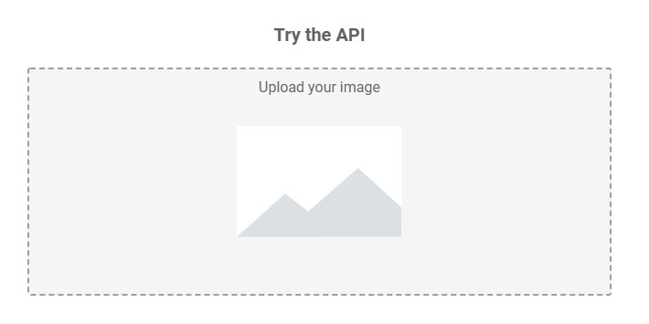

Just drop an image file from your computer into the designated area to see what Google Vision API can tell you about the image.  

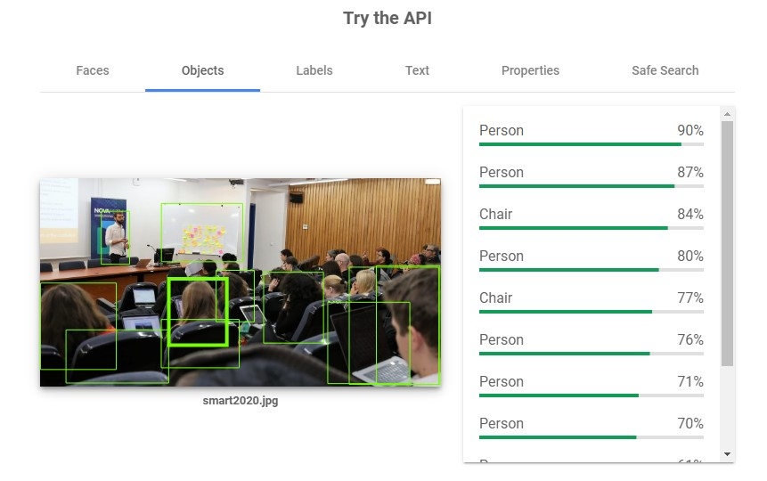

The drag-and-drop demo is good enough if you only have a few images at hand to process.  In research, you may need to process hundreds or even thousands of images.   When you need to analyse images in batch, you should sign up for Google Cloud and use a suitable API client.

## Signing up for Google Cloud
If you have signed up for Google Cloud already, please jump to [Obtaining a credential key file](#obtaining-a-credential-key-file). 

Log on to [Google Cloud Platform](https://console.cloud.google.com) using your Gmail account.  Click `Activate` on the top right corner or `TRY FOR FREE` in the centre.

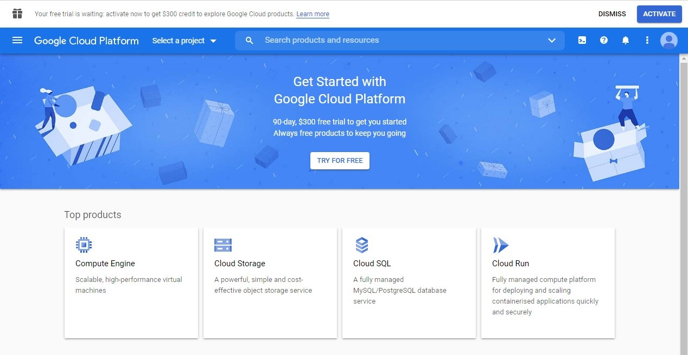

Choose your country and check the box to agree to the service terms.  Click `CONTINUE`.

Complete the form with your name, address and details of your payment card.  

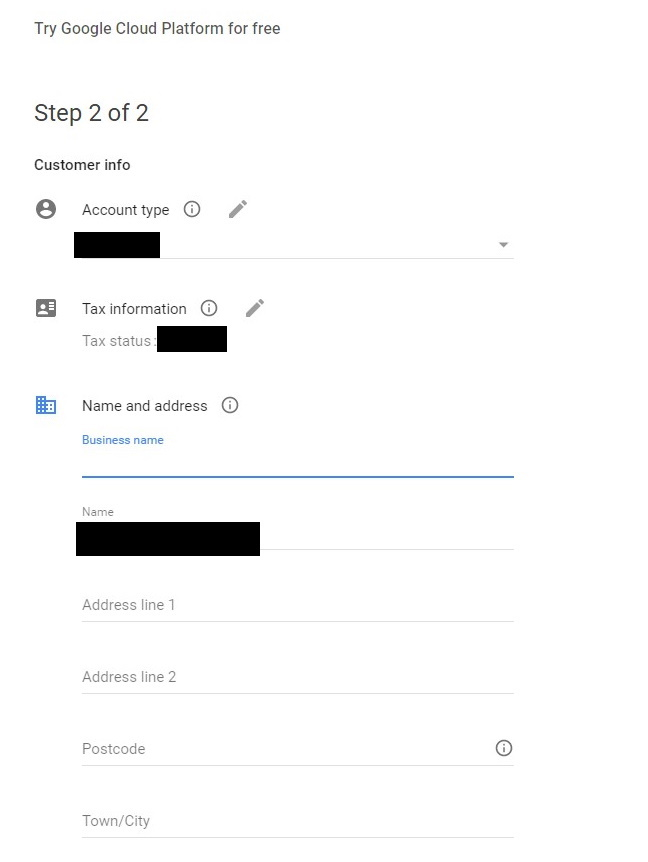

You must provide Google with a valid debit / credit card.  Otherwise, you will not be able to use Google Vision API.  From my experience, Google will check if your card is valid but will not charge on your card when you sign up.

Click `START MY FREE TRIAL` when you are done.

## Obtaining a credential file

After signing up for Google Cloud, you need to [create a project](#create-a-project), [enable Vision API](#enable-vision-api) and [create a service account](#create-a-service-account) before you can use Google Vision API.

### Create a project

Click `Select a project` on the top.  Then Click `NEW PROJECT`.

Give a name to the project.  Click `CREATE`.

### Enable Vision API

Click the sandwich menu button on the top left.  Navigate to `API & Services` -> `Library`.  

Click `Cloud Vision API`

If you are unable to find `Cloud Vision API` for some reason, please type `vision` into the search box.  You should be able to see it now.  Click `Cloud Vision API`.

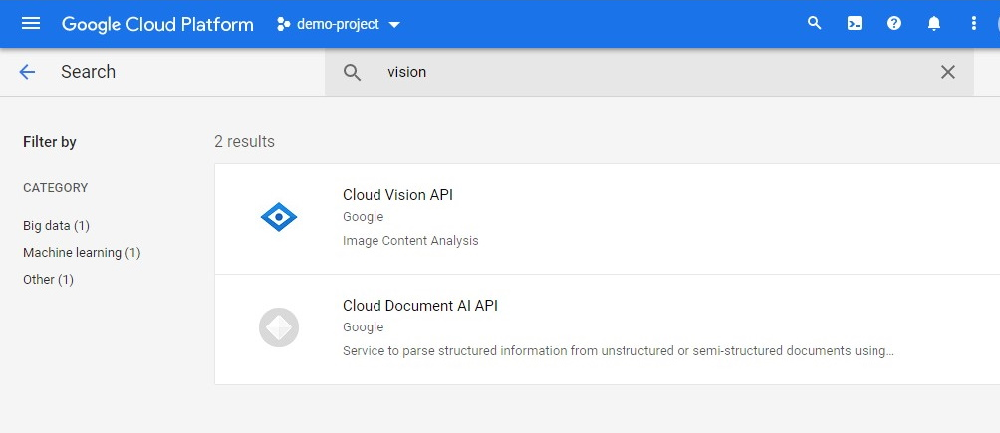

Click `Enable`

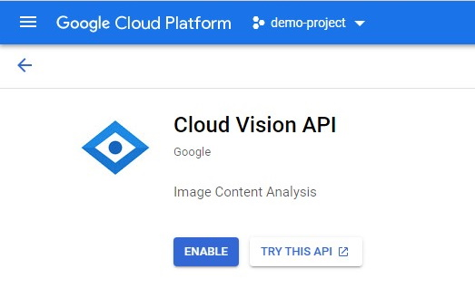

### Create a service account

Click the sandwich menu button on the top left.  Navigate to `IAM & Admin` -> `Service Accounts`.  

Click `CREATE SERVICE ACCOUNT`.

Give a name to the account.  It is usually a name for your computer as service accounts are usually issued to computers.  Click `CREATE`.

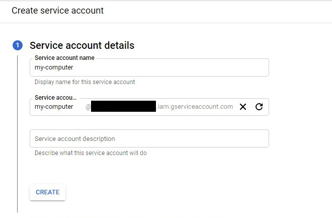

Click `Select a role`

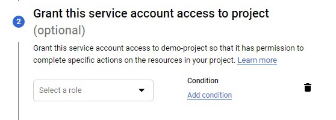

Navigate to `Basic` -> `Owner`.  

Click `CONTINUE`.

Leave these fields blank.  Click `DONE`.

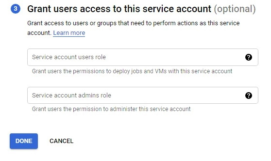

Under `Actions` on the right-hand side, click the sandwich button on the row of the service account you created just now.  Click `Create key`.

Select `JSON` for `Key type`.  Click `CREATE`.

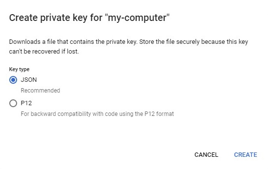

Your browser should automatically download a .json file or ask you to save a .json file.  This is the `Google Cloud credential file` that Memespector-GUI will need.  Please move the credential file to a safe location after downloading.

## Downloading Memespector-GUI

Visit [here](https://github.com/jason-chao/memespector-gui/releases/tag/0.0.1beta) to download Memesecptor-GUI.  Under `Assets`, choose the zip file that corresponds to the operating system on your computer.  

For Windows, please choose the win64 version by default.  Choose the win32 version if the win64 version does not work or you are sure that your Windows is 32-bit which is usually found on older computers.

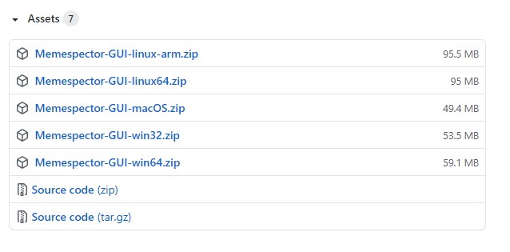

## Opening Memespector-GUI for the first time

When you open Memespector-GUI for the first time on Windows or Mac, the operating system may decline to run Memespector-GUI because of tightened security measures.  You have to take some extra steps to ask Windows or Mac to allow Memespector-GUI to run on your computer.

Usually, you will only need to take these extra steps once.  Next time, Memespector-GUI should run without further hindrance. 

### On Windows

After unzipping the zip file, you will see the file `Memespector-GUI.exe` with an eye's icon. (Note: The file extension .exe may be hidden depending on the settings.)  Double click on it to open Memespector-GUI.

If you see a window telling you not to run the app.  Click `More info`.

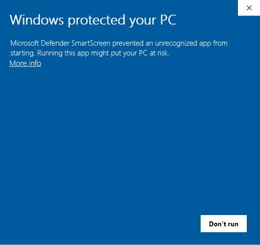

You will see that a new button will appear at the bottom.  Click `Run anyway`.  Then, Memespector-GUI should open in a few seconds.

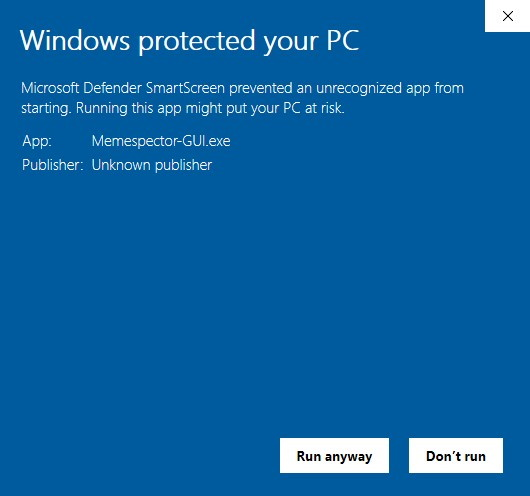

### On Mac

Safari may have unzipped the zip file automatically for you after downloading it.  Open the `Memespector-GUI-macOS` folder and click `Memespector-GUI` inside.

If you see a window asking that are you sure you want to open Memespector-GUI, click `Open`.  Then, Memespector-GUI should open in a few seconds.

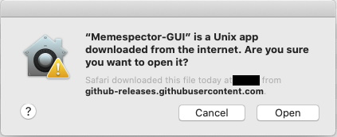

However, in some cases, you may not see the window above but instead encounter another window without an Open button.  In this case, see the additional steps as follows.

In case you see a window telling you that Memespector-GUI cannot be opened, click `Ok`.

Open [System Preferences](https://support.apple.com/guide/macbook-pro/system-preferences-apda966cb8af/mac) on your Mac.  Click `Security & Privacy`.

Navigate to the `General` tab.  You should be able to see `"Memespector-GUI" was blocked from use because it is not from an identified developer` at the bottom of the tab.  Click `Open Anyway` to the right of that message.

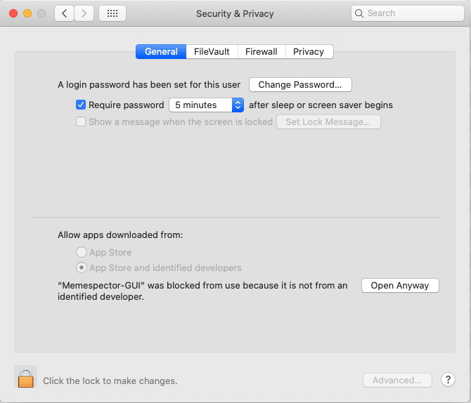

Click `Open`.

